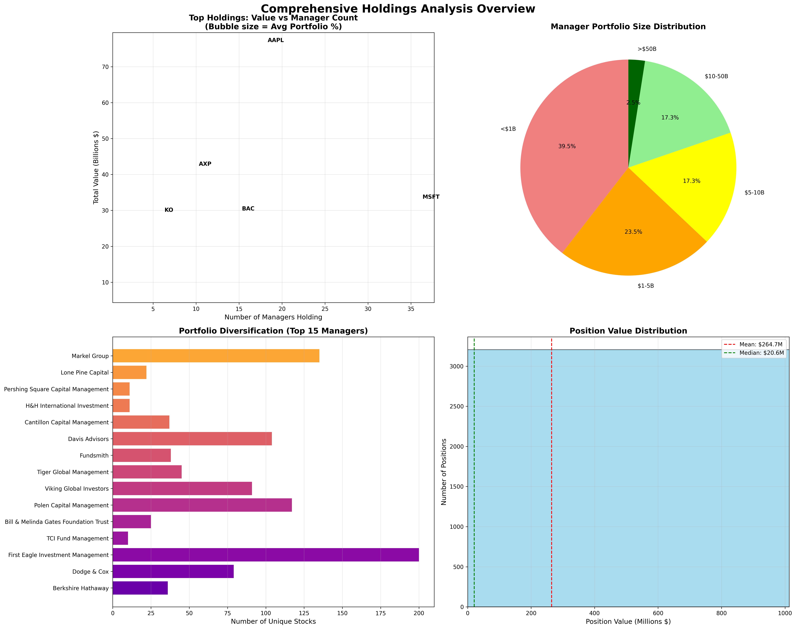
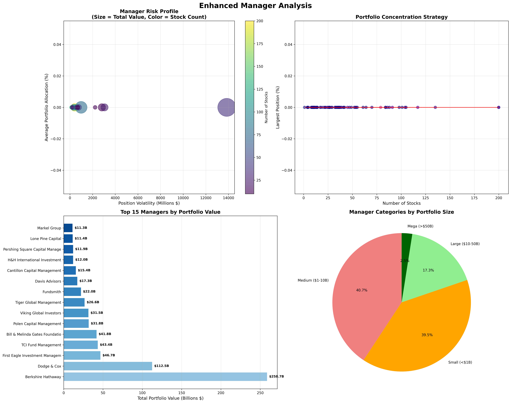
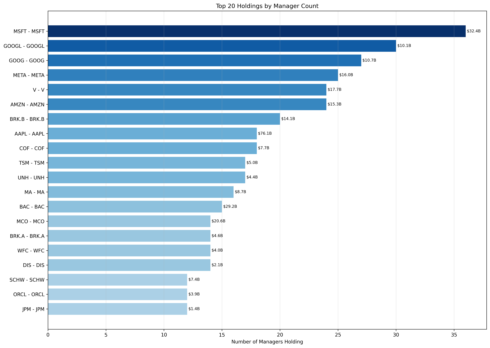
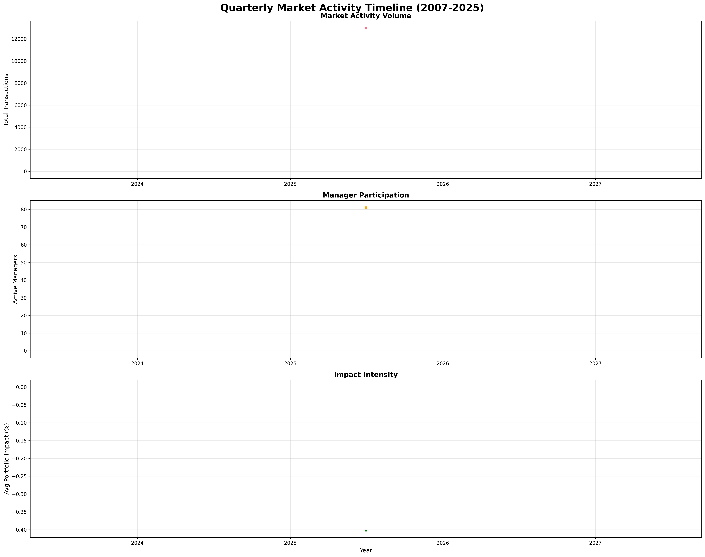

# 📊 Dataroma Investment Analysis Suite

> **Comprehensive institutional investment analysis powered by real portfolio data from 81 top managers**

This repository provides a complete solution for analyzing institutional investment data from [Dataroma](https://www.dataroma.com), tracking **$1.7+ trillion** in assets under management across **3,311 current holdings** and **57,575 historical activities**.

## 🔥 **Key Insights at a Glance**

### Current Market Analysis


**📈 Market Dynamics & Investment Trends**


### Enhanced Manager Analysis


### Manager Performance Tracking


### Popular Holdings Analysis


---

## 📈 **Historical Performance Analysis (3-Year)**

### Manager Performance Evolution


### Market Activity Timeline (2007-2025)


### Top Investment Plays


### Performance Distribution Analysis


---

## 📊 **Current Analysis Reports**

### 🎯 **Core Investment Analysis**
| Report | Description | Link |
|--------|-------------|------|
| **Interesting Stocks Overview** | Best opportunities scored & ranked | [📄 CSV](analysis/interesting_stocks_overview.csv) |
| **High Conviction Stocks** | Where smart money is most concentrated | [📄 CSV](analysis/high_conviction_stocks.csv) |
| **Multi-Manager Favorites** | Stocks held by multiple top managers | [📄 CSV](analysis/multi_manager_favorites.csv) |
| **Hidden Gems** | Under-the-radar opportunities | [📄 CSV](analysis/hidden_gems.csv) |
| **Top Holdings** | Most valuable positions by total $ | [📄 CSV](analysis/top_holdings.csv) |

### 📈 **Activity & Momentum Analysis**
| Report | Description | Link |
|--------|-------------|------|
| **Momentum Stocks** | Recent buying activity trends | [📄 CSV](analysis/momentum_stocks.csv) |
| **New Positions** | Fresh manager acquisitions | [📄 CSV](analysis/new_positions.csv) |
| **Concentration Changes** | Portfolio allocation shifts | [📄 CSV](analysis/concentration_changes.csv) |
| **52-Week Low Buys** | Value buying opportunities | [📄 CSV](analysis/52_week_low_buys.csv) |
| **52-Week High Sells** | Profit-taking activities | [📄 CSV](analysis/52_week_high_sells.csv) |
| **Most Sold Stocks** | Recent institutional exits | [📄 CSV](analysis/most_sold_stocks.csv) |
| **Contrarian Plays** | Against-the-trend positions | [📄 CSV](analysis/contrarian_plays.csv) |

### 💰 **Value & Price Analysis**
| Report | Description | Link |
|--------|-------------|------|
| **Stocks Under $5** | Ultra-low price opportunities | [📄 CSV](analysis/stocks_under_$5.csv) |
| **Stocks Under $10** | Low-price institutional picks | [📄 CSV](analysis/stocks_under_$10.csv) |
| **Stocks Under $20** | Affordable growth plays | [📄 CSV](analysis/stocks_under_$20.csv) |
| **Stocks Under $50** | Mid-price value opportunities | [📄 CSV](analysis/stocks_under_$50.csv) |
| **Stocks Under $100** | Institutional favorites under $100 | [📄 CSV](analysis/stocks_under_$100.csv) |

### 🏢 **Manager & Market Analysis**
| Report | Description | Link |
|--------|-------------|------|
| **Manager Performance** | Performance metrics & rankings | [📄 CSV](analysis/manager_performance.csv) |
| **Highest Portfolio Concentration** | Most focused positions | [📄 CSV](analysis/highest_portfolio_concentration.csv) |
| **Sector Distribution** | Asset allocation by sector | [📄 CSV](analysis/sector_distribution.csv) |
| **Sector Rotation** | Sector momentum analysis | [📄 CSV](analysis/sector_rotation.csv) |
| **Mega-Cap Favorites** | Large-cap institutional picks | [📄 CSV](analysis/mega_cap_favorites.csv) |

---

## 📅 **Historical Analysis Reports (3-Year)**

### 🎯 **Long-Term Performance Tracking**
| Report | Description | Link |
|--------|-------------|------|
| **3-Year Manager Performance** | Complete performance evolution with returns | [📄 CSV](analysis/historical/manager_performance_3year_summary.csv) |
| **Stock Performance Winners/Losers** | 1,306 stocks ranked by activity scores | [📄 CSV](analysis/historical/stock_performance_winners_losers.csv) |
| **Top Performing Plays** | 100 best institutional investment plays | [📄 CSV](analysis/historical/top_performing_plays.csv) |
| **Quarterly Activity Timeline** | 73 quarters of market activity trends | [📄 CSV](analysis/historical/quarterly_activity_timeline.csv) |

### 📊 **Historical Concentration Analysis**
| Report | Description | Link |
|--------|-------------|------|
| **Historical Concentration Changes** | Past portfolio shifts (no longer held) | [📄 CSV](analysis/historical/historical_concentration_changes.csv) |
| **Historical Manager Performance** | Inactive managers analysis | [📄 CSV](analysis/historical/historical_manager_performance.csv) |

---

## 🚀 **Quick Start**

### Prerequisites
```bash
# Install dependencies
pip install -r requirements.txt
playwright install chromium
```

### Run Complete Analysis
```bash
# Generate fresh analysis (uses cached data)
python3 analyze_holdings.py

# Run scraper for fresh data (optional)
python3 datorama_scrape.py
```

### Output Structure
```
analysis/
├── visuals/                          # 5 comprehensive charts
├── *.csv                            # 22 analysis reports
├── historical/
│   ├── visuals/                     # 4 historical trend charts  
│   └── *.csv                        # 6 historical analysis reports
├── README.md                        # Detailed findings summary
└── analysis_summary.json           # Programmatic access
```

---

## 🔍 **Key Statistics**

- **📊 Total Data**: 3,311 current holdings + 57,575 historical activities
- **👥 Managers Tracked**: 81 institutional investors
- **📅 Historical Coverage**: 18 years (2007-2025) across 73 quarters
- **🌍 Global Reach**: 1,542 unique stocks from international markets
- **💵 Assets Tracked**: $1.7+ trillion in institutional holdings

---

## 🤖 **Technical Features**

### Smart Data Processing
- **✅ Complete Data Separation**: Current vs historical analysis
- **✅ Enhanced Visualizations**: Multi-dimensional investment insights  
- **✅ Manager Name Resolution**: Real names instead of IDs
- **✅ Performance Calculations**: 3-year returns with portfolio evolution
- **✅ Activity Classification**: Buy/sell/add/reduce parsing

### Analysis Capabilities
- **🎯 Stock Scoring**: Multi-factor ranking algorithms
- **📈 Momentum Detection**: Recent activity trend analysis
- **💰 Value Identification**: Price-based opportunity screening
- **🏢 Manager Evaluation**: Performance and consistency metrics
- **🌊 Market Dynamics**: Concentration index (HHI) analysis

---

## 🔬 **Research Applications**

This tool helps answer critical investment questions:

### 🎯 **Stock Selection**
- Which stocks are being accumulated by multiple successful managers?
- What are the highest conviction plays across all portfolios?
- Where are managers finding value at 52-week lows?

### 📊 **Market Analysis** 
- Which sectors are seeing increased institutional interest?
- What's the concentration risk across different portfolio sizes?
- How do manager trading patterns correlate with market cycles?

### 👥 **Manager Research**
- Which managers have the most consistent 3-year track records?
- Who are the best stock pickers vs. the largest asset managers?
- What's the relationship between portfolio concentration and returns?

---

## 🤝 **Contributing**

This project is designed for:
- 📚 **Educational Research**: Understanding institutional investment patterns
- 🔬 **Academic Analysis**: Market behavior and manager performance studies  
- 🛠️ **Tool Development**: Building enhanced investment research tools

---

## ⚠️ **Disclaimer**

This tool is for **educational and research purposes only**. Investment decisions should always be based on your own due diligence and risk tolerance. Past performance does not guarantee future results.

---

## 📄 **Data Source**

All data sourced from [Dataroma.com](https://www.dataroma.com) - the premier resource for tracking superinvestor portfolios and institutional holdings.

---

*Last Updated: Generated automatically by analysis pipeline*